<div align="center">



<br/>

[](https://pypi.org/project/forge-memory/)
[](https://python.org)
[](#기술-정보)
[](LICENSE)

[English](README.md) · [한국어](README.ko.md)

</div>

---

```
$ claude                              # 세션 시작

[Forge] 경험 3건 로드 (Q > 0.5)
  ⚠ async_timeout — DB 연결은 context manager로 감싸세요 (Q: 0.82)
  ⚠ missing_dotenv — config import 전에 python-dotenv 먼저 설치 (Q: 0.71)
  ℹ pytest_scope — session scope fixture는 teardown 명시 필요 (Q: 0.65)
```

## 설치

```bash
pip install forge-memory    # 또는 uv tool install forge-memory
forge setup                 # DB + hooks + skills (~30초)
forge stats                 # 확인: 0 failures, 0 sessions
```

끝입니다. 평소처럼 코딩하면 Forge가 알아서 배웁니다.

> `forge`가 PATH에 잡혀야 합니다. `uv tool install`은 자동으로 처리되고,
> `pip`은 전역 설치가 필요합니다. 가상환경 안에만 있으면 hooks가 못 찾습니다.

---

## 옆자리 신입사원이라고 생각하세요

Forge는 에이전트 옆에 앉아서 조용히 배우는 신입사원 같은 겁니다.

- **1주차**: 그냥 지켜봅니다. 패턴을 조용히 기록 중.
- **2주차**: *"그거 저번에도 터졌는데, 이렇게 하니까 됐잖아요."*
- **한 달 후**: 문제가 터지기 전에 먼저 챙겨놓습니다. 이 코드베이스의 습관을 압니다.

처음부터 완벽하진 않습니다. 하지만 같이 일할수록 점점 좋아지고 — 진짜 동료와 달리 절대 까먹지 않습니다.

### 어떻게 똑똑하게 작동하나



**검증된 조언만** — 경고를 보냈는데 실제로 도움이 됐으면 점수가 오르고, 무시당했으면 내려갑니다. 점수가 높은 경험만 다음 세션에 들어갑니다.

**최신 우선** — 오래된 패턴은 자동으로 밀려납니다. 3개월 전 에러를 매번 주입하느라 토큰 낭비할 일 없습니다.

**알아서 개선하는 포맷** — 같은 경고를 4가지로 표현해보고, 에이전트가 실제로 잘 따르는 포맷으로 수렴합니다.

## 비교

| | 아무것도 안 씀 | CLAUDE.md만 | **Forge** |
|---|---|---|---|
| 에러 반복 | 매 세션 | 규칙 있으면 줄어듦 | 발생 전 경고 |
| 지식 축적 | 세션 끝 = 소멸 | 직접 작성 | 자동 기록 |
| 관리 | 없음 (고통은 누적) | 규칙마다 직접 | 없음 — 자동 |
| 프로젝트 간 공유 | 불가 | 복붙 | 2개+ 프로젝트면 자동 |
| 효과 측정 | 불가 | 불가 | 8개 KPI |
| 토큰 비용 | 삽질에 소모 | 고정 (매번 전체 로드) | 검증된 것만 동적 주입 |

> **CLAUDE.md와 역할이 다릅니다.** CLAUDE.md는 원칙을 정하고, Forge는 원칙이 못 잡는 실전 예외를 처리합니다.

## Forge Score

잘 돌아가고 있는지 숫자 하나로 확인:

```
$ forge score

=== Forge Score (workspace: default) ===

  Forge Score:     0.68 / 1.00

  학습 효과:             0.72
  컨텍스트 적중률:       0.65
  토큰 효율:             0.58
  패턴: 47개 | 세션: 23개
```

**0.5 이상** = 놓치는 것보다 잡는 게 많음 · **0.7 이상** = 확실히 효과 있음

`forge score --detail`로 항목별 상세를 볼 수 있습니다.

## 기능

**매 세션에서 배움** — 실패와 해결을 자동으로 기록. 태깅이나 메모 필요 없음.

**쓸모 있을 때만 말함** — 실제 결과로 경험을 랭킹. 컨텍스트 창이 깨끗하게 유지됨.

**뒤를 봐줌** — 커밋 전에 API 키 잡아내고, `--no-verify` 막고, 세션 길어지면 `/compact` 권유.

**프로젝트를 넘어서 똑똑해짐** — 같은 패턴이 2개+ 프로젝트에서 보이면 자동으로 전체 공유.

**무한 루프 끊음** — 같은 실패만 반복하고 있으면 감지해서, 토큰 더 태우기 전에 끊어줌.

**에이전트 팀 오케스트레이션** — 멀티에이전트 팀 실행을 관리하고, 어떤 구성이 잘 됐고 뭐가 실패했는지 자동 수집.

**모델 자동 라우팅** — 과거 성공률 기반으로 태스크별 최적 모델(Haiku/Sonnet/Opus)을 자동 선택. 설정 필요 없음.

**셀프 튜닝** — `forge optimize`가 실제 세션 데이터로 파라미터 조합을 탐색해서, Forge Score를 올려주는 최적 설정을 자동 적용.

## 적응 기간

Forge는 실제 세션을 거쳐야 배웁니다 — 쓸수록 좋아집니다:

- **1~3세션**: 조용히 지켜보는 중. 메모만 하고 있음.
- **4~5세션**: *"어, 이거 전에도 본 건데?"* 첫 경고가 뜸.
- **6세션~**: 문제를 예측하기 시작함. Forge Score가 올라감.

쓸데없는 말 할 바엔 조용히 있는 게 낫다는 설계입니다.

## 명령어

```bash
# 기본
forge setup                  # 최초 설치
forge score                  # 점수 확인
forge score --detail         # 항목별 상세
forge config                 # 설정 보기
forge stats                  # 통계

# 데이터
forge list                   # 전체 경험 목록
forge search -t python       # 태그 검색
forge detail PATTERN         # 패턴 상세
forge record failure         # 수동 기록
forge promote ID             # 글로벌 승격

# 자동 (hooks가 실행, 직접 호출할 일 없음)
forge resume                 # 세션 시작 → 경험 주입
forge detect                 # 코딩 중 → 실시간 경고
forge writeback              # 세션 종료 → 학습
```

## 설정

```bash
forge config                       # 기본 10개
forge config --advanced            # 전체 40+개
forge config --set alpha=0.15      # 값 변경
```

기본값이 이미 최적화되어 있어서 건드리지 않아도 됩니다.

## 프라이버시

모든 데이터는 `~/.forge/forge.db`에 저장됩니다. 외부 전송 없음. SQLite 파일이라 직접 열어볼 수 있고, 지우면 완전히 사라집니다.

## 기술 정보

| | |
|---|---|
| 패키지 | [forge-memory](https://pypi.org/project/forge-memory/) |
| 테스트 | 1,243 통과 |
| 의존성 | 2개 (typer, pyyaml) |
| DB | SQLite (내장) |
| Python | 3.12+ |
| 라이선스 | MIT |

### 참고

- **[MemRL](https://arxiv.org/html/2601.03192v2)** — Q-learning 기반 경험 랭킹
- **[OpenViking](https://github.com/nicepkg/OpenViking)** — 계층적 컨텍스트 주입
- **[Claude Code](https://docs.anthropic.com/en/docs/claude-code)** — 자동 학습을 가능하게 하는 Hook 시스템

## License

MIT
